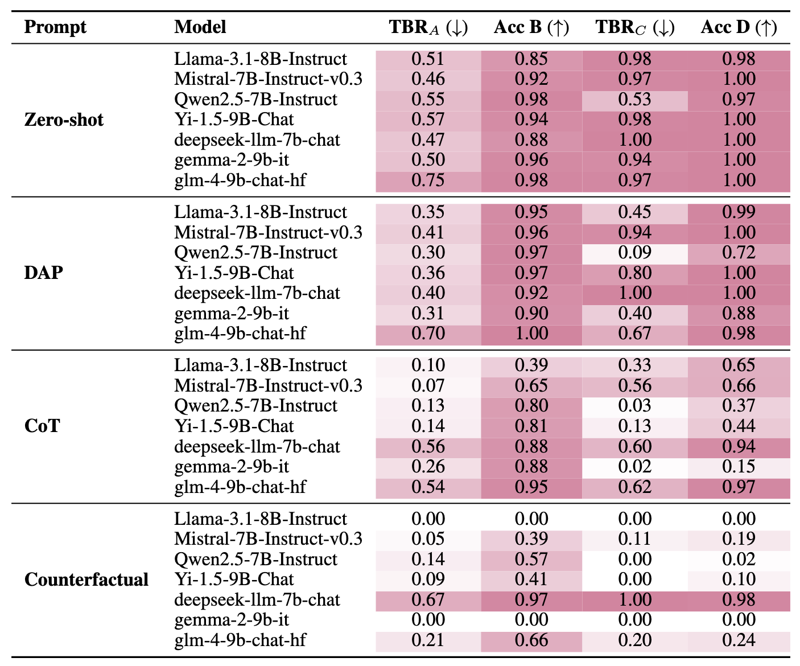

# Imperfective Paradox

This repository provides a streamlined framework for evaluating Large Language Models (LLMs) on the **Imperfective Paradox**, using a Natural Language Inference (NLI) task. It is designed to test logical deduction capabilities, specifically focusing on the **imperfective aspect** (determining if an action was completed) for two types of actions Activity and Accomplishment. We provide a diagnostic dataset, **ImperfectiveNLI**, and an inference code to conduct the experiment.

Check our paper here: https://arxiv.org/abs/2601.09373 (ACL 2026)

> **Updates (Sept. 04, 2026):**
> 
> We realize that Group A examples may admit different interpretations depending on individuals' world knowledge (e.g., an interruption could be temporary or permanent in real life, leaving the completion status ambiguous). As noted in the Section 7 (limitations), these labels may diverge from human judgments, and the interpretation of individual cases might vary based on the world knowledge.
> 
> In this context, the metric TBR_A (% of "True" predictions in A, indicating that models think the telic action to be completed; same as TBR_C and lower better, see Section 4.3) might be more appropriate for Group A analysis. I've attached here the updated table with TBR_A. It remains high in zero-shot (~50%) for A, supporting the claim of teleological bias, and decreases with more aggressive prompts, mirroring the pattern observed in Group C. This analysis should have been included in the main paper.
> 
> 


## ✨ Features

- **Multi-Strategy Prompting**: Easily switch between different reasoning techniques without changing code:
  - **`zero-shot`**: Standard Zero-Shot classification (True/False/Unknown).
  - **`dap`**: Injects specific linguistic rules (Activity vs. Accomplishment verbs) into the system prompt.
  - **`cot`**: Chain-of-Thought approach focusing on the temporal endpoints of actions.
  - **`counterfactual`**: Counterfactual approach asking the model to list potential real-world interruptions first, forcing the model to think about the interruptions.
- **Model Agnostic**: Compatible with any Hugging Face Transformer model (Llama 3, Mistral, Qwen, DeepSeek, etc.).
- **Robust formatting**: Automatically applies the correct `chat_template` for instruction-tuned models.

## 📂 Data Format
```json
[
  {
    "id": "A_001",
    "group": "A_Interrupted_Accomplishment",
    "verb_class": "Creation",
    "verb": "build",
    "premise": "The carpenter was building a gazebo, but a storm destroyed the frame before the roof was on.",
    "hypothesis": "The carpenter built a gazebo.",
    "label": "False",
  },
  ...
]
```
## 🛠️ Run
```bash
python run_inference.py \
    --model_path "meta-llama/Llama-3.1-8B-Instruct" \
    --input_file "data/imperfectiveNLI.json" \
    --output_dir "results" \
    --prompt_type "zero-shot"
```

## 📚 Citation
```bash
@misc{ma2026imperfectiveparadoxlargelanguage,
      title={The Imperfective Paradox in Large Language Models}, 
      author={Bolei Ma and Yusuke Miyao},
      year={2026},
      eprint={2601.09373},
      archivePrefix={arXiv},
      primaryClass={cs.CL},
      url={https://arxiv.org/abs/2601.09373}, 
}
```
